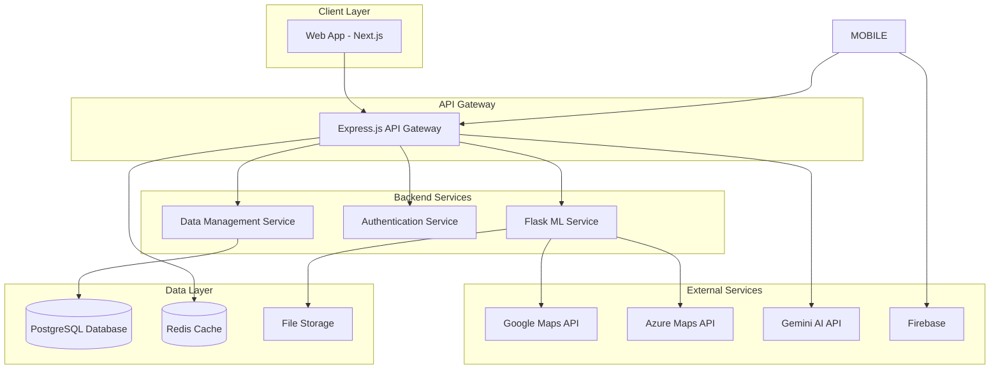

# CityCircuit Design Document

## Overview

CityCircuit is a comprehensive bus route optimization platform that leverages machine learning to analyze population density data and optimize bus routes for improved efficiency, accessibility, and sustainability. The system consists of three main components: a web application for bus operators and passengers, a mobile application for on-the-go access, and a backend ML service for route optimization.

The architecture follows a microservices approach with clear separation between the frontend interfaces, API layer, and machine learning processing engine. This design enables scalability, maintainability, and independent deployment of different system components.

## Architecture

### High-Level Architecture



### Component Architecture

The system is organized into distinct layers:

1. **Presentation Layer**: Web and mobile applications providing user interfaces
2. **API Layer**: Express.js gateway handling routing, authentication, and request orchestration
3. **Business Logic Layer**: Flask-based ML service and supporting microservices
4. **Data Layer**: PostgreSQL for persistent storage, Redis for caching, file storage for datasets
5. **Integration Layer**: External API integrations for mapping, AI, and mobile services

## Components and Interfaces

### Web Application (Next.js)
- **Purpose**: Primary interface for bus operators and passengers
- **Key Features**: Route visualization, optimization results, passenger journey planning
- **Technologies**: Next.js, TailwindCSS, Framer Motion
- **APIs**: Communicates with Express.js API Gateway
- **State Management**: React Context for user sessions and application state

### API Gateway (Express.js)
- **Purpose**: Central routing and orchestration layer
- **Responsibilities**: Request routing, authentication, rate limiting, response aggregation
- **Endpoints**: 
  - `/api/routes` - Route management and optimization
  - `/api/users` - User authentication and profiles
  - `/api/maps` - Mapping service integration
  - `/api/chat` - Chatbot interactions

### ML Service (Flask)
- **Purpose**: Core route optimization and analysis engine
- **Key Components**:
  - Route optimization algorithms using TensorFlow
  - Population density analysis
  - Path matrix calculations
  - Data preprocessing pipelines
- **Input**: Route data, population density datasets, bus stop coordinates
- **Output**: Optimized routes, efficiency metrics, visualization data

### Authentication Service
- **Purpose**: User management and security
- **Features**: JWT token management, role-based access control, session handling
- **Integration**: Works with both web and mobile applications

### Data Management Service
- **Purpose**: Database operations and data validation
- **Responsibilities**: CRUD operations, data integrity, backup management
- **Database Schema**: Routes, stops, users, optimization results, system configuration

## Data Models

### Route Model
```typescript
interface Route {
  id: string;
  name: string;
  description: string;
  stops: BusStop[];
  operatorId: string;
  isActive: boolean;
  optimizationScore: number;
  estimatedTravelTime: number;
  createdAt: Date;
  updatedAt: Date;
}
```

### BusStop Model
```typescript
interface BusStop {
  id: string;
  name: string;
  coordinates: {
    latitude: number;
    longitude: number;
  };
  address: string;
  amenities: string[];
  dailyPassengerCount: number;
  isAccessible: boolean;
}
```

### User Model
```typescript
interface User {
  id: string;
  email: string;
  role: 'operator' | 'passenger' | 'admin';
  profile: {
    name: string;
    organization?: string;
    preferences: UserPreferences;
  };
  createdAt: Date;
  lastLoginAt: Date;
}
```

### OptimizationResult Model
```typescript
interface OptimizationResult {
  id: string;
  originalRouteId: string;
  optimizedRoute: Route;
  metrics: {
    timeImprovement: number;
    distanceReduction: number;
    passengerCoverageIncrease: number;
    costSavings: number;
  };
  populationData: PopulationDensityData;
  generatedAt: Date;
}
```

### PopulationDensityData Model
```typescript
interface PopulationDensityData {
  id: string;
  region: string;
  coordinates: GeoBounds;
  densityPoints: DensityPoint[];
  dataSource: string;
  collectedAt: Date;
}

interface DensityPoint {
  coordinates: {
    latitude: number;
    longitude: number;
  };
  population: number;
  demographicData: {
    ageGroups: Record<string, number>;
    economicIndicators: Record<string, number>;
  };
}
```

## Correctness Properties

*A property is a characteristic or behavior that should hold true across all valid executions of a system-essentially, a formal statement about what the system should do. Properties serve as the bridge between human-readable specifications and machine-verifiable correctness guarantees.*

### Route Optimization Properties

**Property 1: Route analysis completion**
*For any* valid route data input, the ML analysis should complete successfully and produce optimization results
**Validates: Requirements 1.1**

**Property 2: Population-based optimization**
*For any* population density dataset, the Route_Optimizer should generate valid optimized route suggestions
**Validates: Requirements 1.2**

**Property 3: Metrics calculation completeness**
*For any* completed route optimization, the system should calculate and display efficiency improvements and time savings
**Validates: Requirements 1.3**

**Property 4: Route ranking consistency**
*For any* set of route options, they should be consistently ranked by efficiency metrics in descending order
**Validates: Requirements 1.4**

**Property 5: Export format compliance**
*For any* route data export, importing the exported data should produce equivalent route information
**Validates: Requirements 1.5**

### Passenger Service Properties

**Property 6: Route finding completeness**
*For any* valid origin and destination stop pair, the system should return all available connecting routes
**Validates: Requirements 2.1**

**Property 7: Route information completeness**
*For any* displayed route, the information should include both estimated travel time and distance data
**Validates: Requirements 2.2**

**Property 8: Real-time data integration**
*For any* available real-time bus location data, the system should provide current locations and arrival predictions
**Validates: Requirements 2.3**

**Property 9: Route option sorting**
*For any* set of route options between two stops, they should be sorted by travel time and convenience metrics
**Validates: Requirements 2.4**

**Property 10: Route detail completeness**
*For any* route detail request, the display should include all intermediate stops and transfer points
**Validates: Requirements 2.5**

### Platform Integration Properties

**Property 11: Offline functionality preservation**
*For any* mobile app session without network connectivity, core route viewing functionality should remain available
**Validates: Requirements 3.2**

**Property 12: Map API integration reliability**
*For any* valid map data request, the system should successfully retrieve data from Google Maps or Azure Maps APIs
**Validates: Requirements 3.3**

**Property 13: Cross-platform preference persistence**
*For any* user preference setting, saving on one platform should make it available on all other platforms
**Validates: Requirements 3.4**

**Property 14: Multi-language support consistency**
*For any* supported language setting, all interface elements should be properly localized
**Validates: Requirements 3.5**

### Chatbot Assistant Properties

**Property 15: Contextual response generation**
*For any* user chat initiation, the chatbot should provide responses relevant to the current user activity context
**Validates: Requirements 4.1**

**Property 16: Complex query escalation**
*For any* query exceeding complexity thresholds, the chatbot should trigger escalation or provide detailed explanations
**Validates: Requirements 4.3**

**Property 17: Language-specific communication**
*For any* user with a language preference, chatbot responses should be in that preferred language
**Validates: Requirements 4.4**

**Property 18: Conversation context maintenance**
*For any* chat session, conversation history should be maintained and accessible for context-aware assistance
**Validates: Requirements 4.5**

### System Administration Properties

**Property 19: Route data validation**
*For any* route data update, the system should validate it against transportation standards before acceptance
**Validates: Requirements 5.1**

**Property 20: Bus stop integration**
*For any* new bus stop addition, it should be automatically integrated into existing route calculations
**Validates: Requirements 5.2**

**Property 21: Secure data backup**
*For any* data backup operation, all route and user data should be exported securely and completely
**Validates: Requirements 5.4**

**Property 22: Analytics data generation**
*For any* system usage, analytics on usage patterns and optimization effectiveness should be collected
**Validates: Requirements 5.5**

### External Integration Properties

**Property 23: Mapping service integration**
*For any* mapping data request, the system should successfully retrieve information from configured mapping APIs
**Validates: Requirements 6.1**

**Property 24: Rate limit handling**
*For any* API usage approaching rate limits, the system should implement caching and request optimization
**Validates: Requirements 6.2**

**Property 25: Service degradation gracefully**
*For any* external service unavailability, the system should maintain functionality using cached data
**Validates: Requirements 6.3**

**Property 26: AI service integration**
*For any* chatbot request, the system should properly integrate with Gemini API for response generation
**Validates: Requirements 6.4**

**Property 27: Credential security**
*For any* API key configuration, credentials should be securely encrypted and managed
**Validates: Requirements 6.5**

**Property 28: API error handling**
*For any* API request failure, the system should implement proper error handling and retry mechanisms
**Validates: Requirements 7.5**

## Error Handling

### Route Optimization Errors
- **Invalid Route Data**: Validate input format and provide specific error messages for malformed route data
- **ML Processing Failures**: Implement fallback algorithms and graceful degradation when ML services are unavailable
- **Population Data Issues**: Handle missing or incomplete demographic data with interpolation or default values

### API Integration Errors
- **Mapping Service Failures**: Implement circuit breaker patterns and fallback to cached map data
- **Rate Limit Exceeded**: Queue requests and implement exponential backoff with user notifications
- **Authentication Failures**: Refresh tokens automatically and provide clear error messages for invalid credentials

### Data Persistence Errors
- **Database Connection Issues**: Implement connection pooling and automatic retry with exponential backoff
- **Data Validation Failures**: Provide detailed validation error messages and suggest corrections
- **Backup/Export Failures**: Implement partial backup recovery and data integrity verification

### User Interface Errors
- **Network Connectivity Issues**: Provide offline mode with cached data and clear connectivity status
- **Invalid User Input**: Client-side validation with real-time feedback and error prevention
- **Session Management**: Automatic session refresh and graceful handling of expired sessions

## Testing Strategy

### Dual Testing Approach

The CityCircuit system will implement both unit testing and property-based testing to ensure comprehensive coverage and correctness validation.

#### Unit Testing
- **Framework**: Jest for JavaScript/TypeScript components, pytest for Python ML services
- **Coverage Areas**:
  - API endpoint functionality and error handling
  - Database operations and data validation
  - UI component behavior and user interactions
  - External API integration points
- **Test Organization**: Co-located with source files using `.test.ts` and `_test.py` suffixes
- **Mock Strategy**: Mock external APIs and database connections for isolated testing

#### Property-Based Testing
- **Framework**: fast-check for JavaScript/TypeScript, Hypothesis for Python
- **Configuration**: Minimum 100 iterations per property test to ensure statistical confidence
- **Property Implementation**: Each correctness property will be implemented as a single property-based test
- **Test Tagging**: Each property-based test will include a comment with the format: `**Feature: city-circuit, Property {number}: {property_text}**`

#### Integration Testing
- **API Testing**: End-to-end API workflow testing with real database connections
- **Cross-Platform Testing**: Verify data consistency between web and mobile applications
- **External Service Testing**: Integration tests with mapping and AI service APIs using test credentials

#### Performance Testing
- **Load Testing**: Simulate multiple concurrent users for route optimization requests
- **ML Performance**: Benchmark route optimization algorithms with various dataset sizes
- **API Response Times**: Monitor and validate response times for all external API integrations

### Test Data Management
- **Synthetic Data Generation**: Create realistic route and population density datasets for testing
- **Test Database**: Separate test database with known data states for consistent testing
- **API Mocking**: Mock external services for reliable and fast test execution
