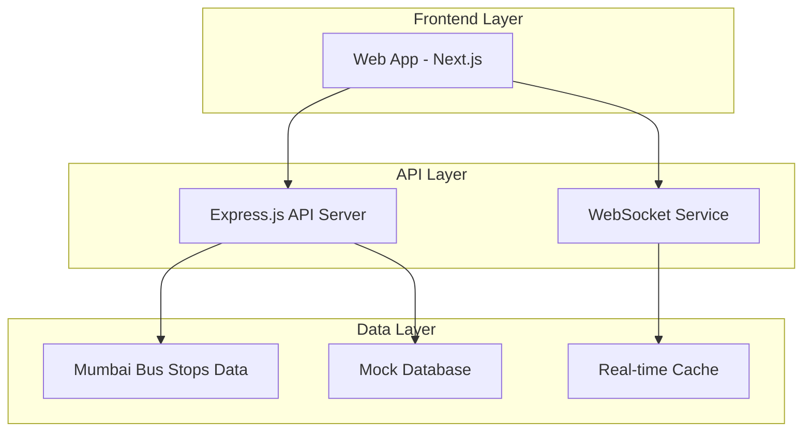

# 🚌 CityCircuit

**Smart Bus Route Optimization System for Mumbai's Transportation Network**

[](https://nextjs.org/)
[](https://www.typescriptlang.org/)
[](https://tailwindcss.com/)
[](https://nodejs.org/)

CityCircuit is a comprehensive web application designed to optimize bus routes for Mumbai's transportation challenges. It provides real-time route analysis, passenger flow optimization, and intelligent route planning using AI-powered algorithms.

## 🌟 Features

### 🔍 **Route Search & Planning**
- Search between **2,505 real Mumbai bus stops**
- Real-time route generation with geographic intelligence
- Multiple route options with travel time estimates
- Interactive route visualization

### 📊 **Real-time Analytics**
- Live passenger count tracking
- Route performance monitoring
- System health dashboards
- Usage analytics and reporting

### 🤖 **AI-Powered Optimization**
- Machine learning route optimization
- Traffic pattern analysis
- Passenger flow prediction
- Dynamic route adjustments

### 👨‍💼 **Administration Tools**
- Route management dashboard
- User role management
- System configuration
- Performance monitoring

### 🌐 **Modern Web Experience**
- Responsive design for all devices
- Real-time data updates
- Intuitive user interface
- Multi-language support

## 🚀 Quick Start

### Prerequisites
- **Node.js** 18+ 
- **npm** or **yarn**
- **Git**

### Installation

```bash
# Clone the repository
git clone https://github.com/your-username/city-circuit.git
cd city-circuit

# Install dependencies
npm install

# Set up environment variables
cp .env.example .env.local

# Start the development environment
npm run start:all
```

### Access the Application
- **Web App**: http://localhost:3001
- **API Server**: http://localhost:5000
- **Health Check**: http://localhost:5000/health

## 🏗️ Architecture



### Technology Stack

| Layer | Technology | Purpose |
|-------|------------|---------|
| **Frontend** | Next.js 14, TypeScript, TailwindCSS | Modern React-based web application |
| **Backend** | Express.js, Node.js | RESTful API server |
| **Real-time** | WebSocket, Mock Service | Live data updates |
| **Data** | JSON files, Mock Database | Bus stops and route data |
| **Testing** | Jest, Fast-Check | Unit and property-based testing |
| **Styling** | TailwindCSS, Framer Motion | Responsive UI with animations |

## 📁 Project Structure

```
city-circuit/
├── 📁 src/                    # Frontend source code
│   ├── 📁 components/         # React components
│   ├── 📁 pages/             # Next.js pages
│   ├── 📁 hooks/             # Custom React hooks
│   ├── 📁 services/          # API and WebSocket services
│   ├── 📁 types/             # TypeScript type definitions
│   └── 📁 utils/             # Utility functions
├── 📁 public/                # Static assets
│   └── 📁 data/              # Mumbai bus stops data (2,505 stops)
├── 📁 scripts/               # Development scripts
│   ├── 📄 mock-api-server.js # Backend API server
│   └── 📄 setup-dev-db.js    # Database setup
├── 📁 .kiro/                 # Project specifications
│   └── 📁 specs/city-circuit/ # Feature specs and tasks
├── 📄 package.json           # Dependencies and scripts
├── 📄 tsconfig.json          # TypeScript configuration
├── 📄 tailwind.config.js     # TailwindCSS configuration
└── 📄 README.md              # This file
```

## 🛠️ Development

### Available Scripts

| Command | Description |
|---------|-------------|
| `npm run dev` | Start Next.js development server (port 3001) |
| `npm run start:backend` | Start Express.js API server (port 5000) |
| `npm run start:all` | Start both frontend and backend |
| `npm run build` | Build for production |
| `npm run test` | Run test suite |
| `npm run test:watch` | Run tests in watch mode |
| `npm run test:coverage` | Run tests with coverage report |
| `npm run lint` | Run ESLint |
| `npm run type-check` | Run TypeScript type checking |

### Environment Variables

Create a `.env.local` file with the following variables:

```env
# Google Maps API Key (optional)
NEXT_PUBLIC_MAPS_API_KEY=your_google_maps_api_key

# Google Gemini AI API Key (optional)
NEXT_PUBLIC_GEMINI_API_KEY=your_gemini_api_key

# Backend API URL
NEXT_PUBLIC_API_URL=http://localhost:5000
```

### Development Workflow

1. **Start Development Servers**
   ```bash
   npm run start:all
   ```

2. **Make Changes**
   - Frontend code in `src/`
   - Backend API in `scripts/mock-api-server.js`
   - Data in `public/data/`

3. **Test Your Changes**
   ```bash
   npm test
   ```

4. **Check Code Quality**
   ```bash
   npm run lint
   npm run type-check
   ```

## 🧪 Testing

The project uses a comprehensive testing strategy:

### Unit Testing
- **Framework**: Jest with React Testing Library
- **Coverage**: Components, utilities, and services
- **Location**: `src/**/__tests__/`

### Property-Based Testing
- **Framework**: Fast-Check
- **Purpose**: Validate universal properties across inputs
- **Examples**: Route generation, data validation

### Running Tests
```bash
# Run all tests
npm test

# Watch mode for development
npm run test:watch

# Generate coverage report
npm run test:coverage
```

## 📊 Data

### Mumbai Bus Stops Dataset
- **Count**: 2,505 real bus stops
- **Format**: JSON with coordinates, ward info, and metadata
- **Source**: Mumbai BEST bus stops data
- **Location**: `public/data/mumbai-bus-stops.json`

### Sample Data Structure
```json
{
  "name": "CHHATRAPATI SHIVAJI MAHARAJ TERMINUS (GPO)",
  "styleUrl": 0,
  "longitude": 72.836604,
  "latitude": 18.938434,
  "ward": "NW-19"
}
```

## 🔌 API Endpoints

### Routes
- `GET /api/routes` - List routes with search and filtering
- `GET /api/routes/:id` - Get specific route details
- `POST /api/optimize` - Optimize route performance

### Bus Stops
- `GET /api/bus-stops` - List Mumbai bus stops with search
- `GET /data/mumbai-bus-stops.json` - Raw bus stops data

### Analytics
- `GET /api/analytics/report` - System analytics
- `GET /api/admin/stats` - Admin dashboard statistics

### Real-time
- `WebSocket /ws` - Real-time data updates
- `POST /api/chat` - AI chatbot interactions

## 🚀 Deployment

### Production Build
```bash
# Build the application
npm run build

# Start production server
npm start
```

### Environment Setup
1. Set up production environment variables
2. Configure real database connections
3. Set up monitoring and logging
4. Configure domain and SSL

### Recommended Hosting
- **Frontend**: Vercel, Netlify, or AWS Amplify
- **Backend**: Railway, Heroku, or AWS EC2
- **Database**: PostgreSQL on AWS RDS or similar

## 🤝 Contributing

We welcome contributions! Please follow these steps:

1. **Fork the repository**
2. **Create a feature branch**
   ```bash
   git checkout -b feature/amazing-feature
   ```
3. **Make your changes**
4. **Add tests for new functionality**
5. **Run the test suite**
   ```bash
   npm test
   ```
6. **Commit your changes**
   ```bash
   git commit -m "Add amazing feature"
   ```
7. **Push to your branch**
   ```bash
   git push origin feature/amazing-feature
   ```
8. **Open a Pull Request**

### Code Style
- Use TypeScript for type safety
- Follow ESLint configuration
- Write tests for new features
- Use meaningful commit messages

## 📝 License

This project is licensed under the MIT License - see the [LICENSE](LICENSE) file for details.

## 🙏 Acknowledgments

- **Mumbai BEST** for providing comprehensive bus stops data
- **OpenStreetMap** for geographic data
- **Next.js Team** for the excellent React framework
- **TailwindCSS** for the utility-first CSS framework

## 📞 Support

- **Documentation**: Check [SETUP.md](SETUP.md) for detailed setup instructions
- **Issues**: Report bugs and feature requests via GitHub Issues
- **Discussions**: Join project discussions on GitHub Discussions

## 🗺️ Roadmap

### Current Version (v1.0.0)
- ✅ Real-time route search with 2,505 Mumbai bus stops
- ✅ Route optimization algorithms
- ✅ Admin dashboard and analytics
- ✅ Responsive web interface

### Future Enhancements
- 🔄 Integration with real Mumbai BEST API
- 🔄 Advanced ML models for traffic prediction
- 🔄 Mobile PWA capabilities
- 🔄 Multi-city support
- 🔄 Real-time GPS tracking integration

---

**Built with ❤️ for Mumbai's transportation future**

*CityCircuit - Making urban mobility smarter, one route at a time.*